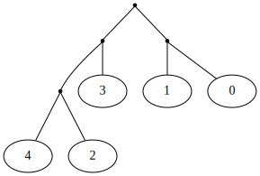
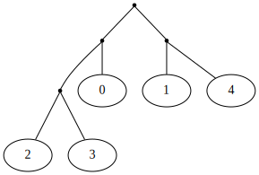
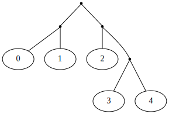
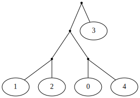

<div align="center">
  <h1>✨ myriade 🌲</h1>
  <p>Hierarchical extreme multiclass and multi-label classification.</p>
</div>
<br>

<div align="center">
  <!-- Tests -->
  <a href="https://github.com/MaxHalford/myriade/actions/workflows/unit-tests.yml">
    
  </a>
  <!-- PyPI -->
  <a href="https://pypi.org/project/myriade">
    
  </a>
  <!-- License -->
  <a href="https://opensource.org/licenses/MIT">
    
  </a>
</div>
<br>


<div align="center">
    
</div>

- [Motivation](#motivation)
- [Installation](#installation)
- [Multiclass](#multiclass)
  - [Example dataset](#example-dataset)
  - [Baselines](#baselines)
    - [Random balanced](#random-balanced)
    - [Optimal](#optimal)
    - [Manual](#manual)
  - [Balanced](#balanced)
- [Multi-label](#multi-label)
- [Datasets](#datasets)
- [Benchmarks](#benchmarks)
- [Contributing](#contributing)
- [License](#license)

## Motivation

Extreme multiclass classification problems are situations where the number of labels is extremely large. Typically, in the order of tens of thousands of labels. These problems can also be multi-label: a sample can be assigned more than one label. Usual methods don't scale well in these cases.

This Python package provides methods to address multiclass classification. It takes a hierarchical approach. The idea being to organize labels into a binary tree, and train a binary classifier at each node.

🏗️ The package is not prime time ready yet, but the existing code is tested and usable. You can use it to perform multiclass classification, but not multi-label classification. Stay tuned! You can also [contribute](#contributing) 🙃

## Installation

```py
pip install myriade
```


## Multiclass

### Example dataset

A multiclass classification dataset contains a 2D matrix/dataframe of features, and a 1D array/series of labels.

For these examples, we'll load the first 5 digits of the UCI ML hand-written digits [dataset](https://scikit-learn.org/stable/modules/generated/sklearn.datasets.load_digits.html).

```py
>>> import myriade
>>> from sklearn import datasets
>>> from sklearn import model_selection
>>> from sklearn import preprocessing

>>> X, y = datasets.load_digits(n_class=5, return_X_y=True)
>>> X = preprocessing.scale(X)
>>> X.shape
(901, 64)

>>> sorted(set(y))
[0, 1, 2, 3, 4]

>>> X_train, X_test, y_train, y_test = model_selection.train_test_split(
...     X, y, test_size=0.5, random_state=42
... )

```

In this case there's only 5 classes, so of course you could just use [scikit-learn's `OneVsRestClassifier`](https://scikit-learn.org/stable/modules/generated/sklearn.multiclass.OneVsRestClassifier.html). The point of this package is to scale to hundreds of thousands of classes, in which case a `OneVsRestClassifier` would be way too slow.

### Baselines

#### Random balanced

The most basic strategy is to organize labels into a random hierarchy. The `RandomBalancedHierarchyClassifier` does just this, by creating a balanced tree. The randomness is controlled with the `seed` parameter.

```py
>>> from sklearn import linear_model

>>> model = myriade.multiclass.RandomBalancedHierarchyClassifier(
...     classifier=linear_model.LogisticRegression(),
...     seed=42
... )
>>> model = model.fit(X_train, y_train)
>>> print(f"{model.score(X_test, y_test):.2%}")
94.01%

```

You can use the `to_graphviz` method of a model's `tree_` attribute to obtain a [`graphviz.Digraph`](https://graphviz.readthedocs.io/en/stable/api.html#graphviz.Digraph) representation.

```py
>>> dot = model.tree_.to_graphviz()
>>> path = dot.render('random', directory='img', format='svg', cleanup=True)

```

</br>
<div align="center">
    
</div>
</br>

☝️ Note that the [`graphviz` library](https://graphviz.readthedocs.io/en/stable/) is not installed by default because it requires a platform dependent binary. Therefore, you have to [install it](https://graphviz.readthedocs.io/en/stable/#installation) by yourself.

#### Optimal

It's also possible to search the spaces of all possible hierarchies, and pick the best one. Hierarchies are compared with each other by estimating their performance with cross-validation.

```py
>>> from sklearn import metrics

>>> cv = model_selection.ShuffleSplit(
...     n_splits=1,
...     train_size=0.5,
...     random_state=42
... )
>>> model = myriade.multiclass.OptimalHierarchyClassifier(
...     classifier=linear_model.LogisticRegression(),
...     cv=cv,
...     scorer=metrics.make_scorer(metrics.accuracy_score),
... )
>>> model = model.fit(X_train, y_train)
>>> print(f"{model.score(X_test, y_test):.2%}")
98.89%

```

```py
>>> dot = model.tree_.to_graphviz()
>>> path = dot.render('optimal', directory='img', format='svg', cleanup=True)

```

</br>
<div align="center">
    
</div>
</br>

The only downside to this method is that the amount of possible hierarchies grows extremely large with the number of labels. In fact, if I'm not mistaken, this amount corresponds to sequence [A001147](https://oeis.org/A001147) in the Online Encyclopedia of Integer Sequences (OEIS):

| Number of labels | Number of possible hierarchies |
|------------------|--------------------------------|
| 1                | 1                              |
| 2                | 1                              |
| 3                | 3                              |
| 4                | 15                             |
| 5                | 105                            |
| 6                | 945                            |
| 7                | 10,395                         |
| 8                | 135,135                        |
| 9                | 2,027,025                      |
| 10               | 34,459,425                     |

This method is therefore only useful for benchmarking purposes. Indeed, for a small number of labels, it's useful to know if a hierarchy is optimal in some sense.

#### Manual

You can also specify a hierarchy manually via the `myriade.Branch` class.

```py
>>> b = myriade.Branch
>>> tree = b(
...     b(0, 1),
...     b(
...         2,
...         b(3, 4)
...     )
... )
>>> dot = tree.to_graphviz()
>>> path = dot.render('manual', directory='img', format='svg', cleanup=True)

```

</br>
<div align="center">
    
</div>
</br>

```py
>>> model = myriade.multiclass.ManualHierarchyClassifier(
...     classifier=linear_model.LogisticRegression(),
...     tree=tree
... )
>>> model = model.fit(X_train, y_train)
>>> print(f"{model.score(X_test, y_test):.2%}")
94.24%

```

### Balanced

The above methods are baselines: they're either too naïve, or too greedy. A smarter idea is to use some sort of heuristic for building the hierarchy. The `BalancedHierarchyClassifier` builds a hierarchy by studying a confusion matrix.

First, a base model produces cross-validated predictions. A confusion matrix is built. The two classes which most confused with each other form a branch. The process is repeated until all classes have been paired together. Next, the confusion matrix is shrinked to that pairs of labels are compared with each other. Then the pairing process is repeated. After roughly `log2(k)` steps, a balanced tree is obtained.

```py
>>> base_model = myriade.multiclass.RandomBalancedHierarchyClassifier(
...     classifier=linear_model.LogisticRegression(),
...     seed=42
... )
>>> cv = model_selection.KFold(
...     n_splits=2,
...     shuffle=True,
...     random_state=42
... )
>>> model = myriade.multiclass.BalancedHierarchyClassifier(
...     classifier=linear_model.LogisticRegression(),
...     base_model=base_model,
...     cv=cv
... )
>>> model = model.fit(X_train, y_train)
>>> print(f"{model.score(X_test, y_test):.2%}")
98.45%

```

```py
>>> dot = model.tree_.to_graphviz()
>>> path = dot.render('balanced', directory='img', format='svg', cleanup=True)

```

</br>
<div align="center">
    
</div>
</br>

## Multi-label

🏗️

## Datasets

| Name | Function    | Size     | Samples | Features | Labels     | Multi-label    | Labels/sample |
|:----:|:-----------:|:---------|:-------:|:--------:|:----------:|:--------------:|:-------------:|
| DMOZ | `load_dmoz` | 614,8 MB | 394,756 | 833,484  | 36,372     | ✓              | 1.02          |
| Wikipedia (small) | `load_wiki_small` | 135,5 MB | 456,886 | 2,085,165  | 36,504     | ✓              | 1.84          |
| Wikipedia (large) | `load_wiki_large` | 1,01 GB | 2,365,436 | 2,085,167  | 325,056     | ✓              | 3.26          |

Each `load_*` function returns two arrays which contain the features and the target classes, respectively. In the multi-label case, the target array is 2D. The arrays are sparse when applicable.

The first time you call a `load_*` function, the data will be downloaded and saved into a `.svm` file that adheres to the [LIBSVM format convention](https://www.csie.ntu.edu.tw/~cjlin/libsvm/faq.html#/Q03:_Data_preparation). The loaders will restart from scratch if you interrupt them during their work. You can see where the datasets are stored by calling `myriade.datasets.get_data_home`.

All of the datasets are loaded in memory with the [`svmloader`](https://github.com/yoch/svmloader/) library. The latter is much faster than the [`load_svmlight_file`](https://scikit-learn.org/stable/modules/generated/sklearn.datasets.load_svmlight_file.html) function from scikit-learn. However, when working repeatedly on the same dataset, it is recommended to wrap the dataset loader with [`joblib.Memory.cache`](https://joblib.readthedocs.io/en/latest/memory.html) to store a memmapped backup of the results of the first call. This enables near instantaneous loading for subsequent calls.

## Benchmarks

🏗️

## Contributing

```sh
# Download and navigate to the source code
git clone https://github.com/MaxHalford/myriade
cd myriade

# Install poetry
curl -sSL https://install.python-poetry.org | POETRY_PREVIEW=1 python3 -

# Install in development mode
poetry install --dev

# Run tests
pytest
```

There's a small roadmap [here](https://github.com/users/MaxHalford/projects/1/views/1) if you're willing to contribute and looking for ideas 🙏

## License

This project is free and open-source software licensed under the [MIT license](LICENSE).
